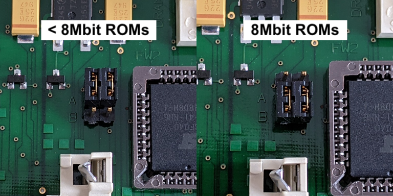
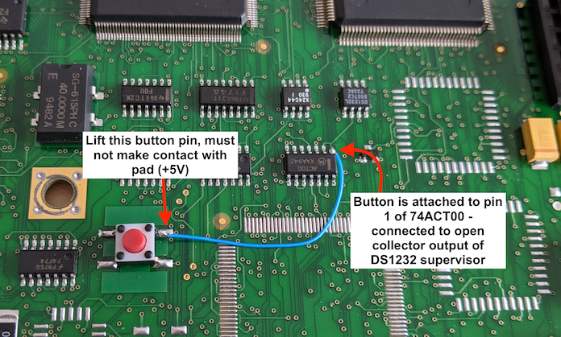

# Cisco 2500 Series Reverse Engineering
Documented here is my effort to reverse engineer enough detail about the Cisco 2500 series router platform in order to be able to run my own code.

A particular goal was to get FreeRTOS running, which involved creating a new port.

### Rationale
These days, a Cisco 2500 doesnt make much of a router, at least not for modern broadband speeds. In terms of processing power it is somewhat limited also, at least compared to modern embedded systems.

But, with a Motorola 68EC030 on board, and a selection of other peripherals including an ethernet controller, it makes for an interesting platform that one might use to "hack about", and presents a ready-built platform on which to do so. They are readily available on ebay for very little money, and have a sturdy steel 19" rack mountable case.

At the time of writing, Coronavirus is also (still) a thing, and this was a good project to keep me occupied and distracted from the general goings on of the world until it passes.

### Platform Brief
The Cisco 2501 which I used during this project has the following notable features:

* Motorola 68EC030 CPU clocked at 20MHz
* Philips SCN2681 dual UART (for the console and aux ports)
* Hitachi HD64570 serial communications adapter (two serial WAN ports)
* AMD AM79C90 ("LANCE") ethernet controller with AUI physical attachment
* 72 pin SIMM slot accepting up to 16Mbyte of DRAM
* 2x 80 pin SIMM slots accepting up to 8Mbyte of FLASH each
* 2x 32 pin PLCC sockets for boot ROMs
* 32Kbyte EEPROM (NVRAM) storing the routers configuration 

These features will be addressed in more detail in their respective sections below.

Two Cisco branded chips on board seem to be quite central to the operation of the router. Almost all memories and peripherals are routed to/through these two chips in some way or another. The chips also appear to be largely responsible for generating all of the control signals to the peripherals and CPU, such as interrupts, bus error signals, etc.

Fortunately, they do not seem to "get in the way" very much, although there are some registers contained within that need to be appropriately configured to ensure proper operation of the router. Largely it seems that they provide muxing and arbitration between all of the peripherals and the CPU, including generating DRAM refresh signals.

### Conventions
I use the following conventions in my documentation:

* A forward slash (/) after a signal name indicates that the signal is active low, or negative logic
* In register bit tables:
  * R indicates that a register is readable
  * W indicates that a register is writable, and will read back the same value written
  * w indicates that a register is writable, but the value read back may not represent what was written, or the register is write-once
  * -0 indicates the bit reads as 0 on reset, and -1 reads as a 1. -? means the bit value is indeterminate on reset (e.g. influenced externally).

### Block Diagram
Ive roughly figured out how everything interconnects, and produced a [block diagram](blob/master/block.pdf). It is not complete, missing some of the finer details like chip selects, read/write, clock, reset, and other signals. Use it as a guide only at this stage, I may get around to filling in the rest of the details over time.

There are two "address busses" indicated from the CPU. PADDR (peripheral address) is a buffered "copy" of the CPUs address bus which seems to be routed primarily to the NVRAM, boot ROMs and UART. The other address bus is the native, unbuffered address bus of the CPU directly.

## Memories

### Boot ROMs
Two 32 pin PLCC sockets hold the boot ROM code. This includes a basic monitor which can be used to probe around the system, and also a minimal IOS image, perhaps enough to run the router if the IOS image in flash is not present or damaged.

The ROMs in my router are 8Mbit in size each, and divided into odd and even bytes. Byte arrangement of the two ROMs is as follows:

* FW1 odd bytes
* FW2 even bytes

The ROMs present a 16 bit wide data path from which the CPU can read instructions and data.

Bit order in these two ROMs was found to be reversed: the least significant bit of a ROM corresponds with its most significant bit as seen by the CPU (D0-D7, D1-D6 etc). A small script was used to reverse the order of the bits and combine odd/even bytes into a single image which could then be loaded into Ghidra for disassembly and analysis.

Boot ROMs are located at address 0x01000000.

**Special note:** A Motorola 68000 CPU expects to read two long words forming the initial stack pointer and PC beginning from address 0, therefore, at least the first 8 bytes of the boot ROMs are mapped to address 0 for the first two long word reads, after which they are remapped to 0x01000000 for code execution.

8Mbit ROMs are particularly interesting in a PLCC32 package. What would normally be the Write Enable pin is replaced with an additional address line. To use smaller sized ROMs in these sockets, two jumpers must be modified to map this signal correctly. Beside the FW2 socket are two 3 pin headers which can be used to configure the function of pin 31:

  * bridging the AB positions configures the sockets for 8Mbit ROMs - pin 31 is low in this configuration, which would assert the Write Enable pin of a smaller sized ROM
  * bridging the A position with the unlabelled position configures the sockets for smaller sized ROMs - pin 31 will be high in this configuration



No manufacturer part number is indicated on the packages, just a Cisco part number and software version, so determining the exact pinout is not necessarily possible, but a similar part from ST (M27C801) indicates there may be some pin incompatibilities between 8Mbit ROMs and smaller sizes. Specifically, the arrangement of address lines on pins 1 and 31 varies slightly between 8Mbit ROMs and the 4Mbit ROMs I have been using for testing (SST39SF040):

<table>
    <thead>
        <tr>
            <th>Size</th><th>Pin 1</th><th>Pin 31</th>
        </tr>
    </thead>
    <tbody>
        <tr>
        	<td>8Mbit</td>
        	<td>A19</td>
        	<td>A18</td>
        </tr>
        <tr>
        	<td>4Mbit</td>
        	<td>A18</td>
        	<td>WE/</td>
        </tr>
    </tbody>
</table>

Given these apparent differences, I can foresee a couple of different scenarios playing out:

* pin compatible ROMs need to be found
* a large enough ROM image may need to be suitably rearranged to compensate for the differences in address lines
* ROM image may need to be limited to 1Mbit (128K) per ROM, or 2Mbit (256K) total
* figure out how to store code in flash, and use the ROM sockets only for bootloading

*See Memory Configuration Register section for details about configuring the valid address window for the boot ROM sockets.*

### NVRAM
NVRAM is a 32Kbyte EEPROM, part number X28HC256J, which holds the routers configuration register (ala 0x2102) and configuration (startup-config).

The NVRAM is soldered to the board as opposed to being socketed. For your own purposes, you might completely ignore this chip, or you might write code to erase and re-program it yourself.

NVRAM is located at address 0x02000000.

The NVRAM presents an 8 bit data path to the CPU.

EEPROMs are not directly writable, and usually require some form of erase operation before data can be written back. Therefore the correct sequence of operations needs to be established before this can function as a form of non-volatile storage. Code execution from this ROM has not yet been tested.

### DRAM
One 72 pin SIMM socket supports a maximum of 16Mbyte of DRAM. Refreshing is handled automatically by one of the Cisco branded chips.

DRAM is located at address 0.

Although the boot ROMs are seemingly mapped to address 0 while the CPU reads the reset vector, addresses 0-7 are subsequently readable and writable as part of the RAM itself. Cisco writes a jump instruction to address 0 which leads to a "jump to zero" error handler.

Presence detect pins of the DRAM socket do not seem to be routed to either of the Cisco branded chips. A software memory sizing routine is implemented to find the size of available DRAM.

*See Memory Configuration Register section for details about configuring the valid address window for the DRAM.*

### Flash
Two 80 pin SIMM sockets provide for 8Mbyte of flash each, totalling 16Mbyte of persistent storage.

Flash is located at address 0x03000000.

Presence detect pins of the flash modules are partially used by one of the Cisco branded chips to enable each of the sockets:

* if PD6 of CODE0 is pulled low, address window 0x03000000-037FFFFF is enabled
* if CODE0 is enabled, and PD6 of CODE1 is pulled low, address window 0x03800000-03FFFFFF is enabled

The CODE1 socket cannot be enabled if the CODE0 socket is not enabled. Attempting to read or write to an address in a window that is not enabled generates a bus error exception.

A word size register was identified at address 0x0211000A which can be read to determine the presence of flash modules in each socket.

**Flash Presence 0x0211000A**
<table>
    <thead>
        <tr>
            <th>Bit 15</th><th></th><th></th><th></th><th></th><th></th><th></th><th>8</th>
            <th>7</th><th></th><th></th><th></th><th></th><th></th><th></th><th>Bit 0</th>
        </tr>
    </thead>
    <tbody>
        <tr>
        	<td></td>
        	<td></td>
        	<td></td>
            <td align="center">R-?</td>
            <td align="center">R-?</td>
        	<td></td>
        	<td></td>
            <td align="center">R-?</td>
        	<td></td>
        	<td></td>
        	<td></td>
        	<td></td>
        	<td></td>
        	<td></td>
        	<td></td>
        	<td></td>
        </tr>
        <tr>
        	<td></td>
        	<td></td>
        	<td></td>
        	<td>C0P6</td>
        	<td>C1P6</td>
        	<td></td>
        	<td></td>
        	<td>C0P4</td>
        	<td></td>
        	<td></td>
        	<td></td>
        	<td></td>
        	<td></td>
        	<td></td>
        	<td></td>
        	<td></td>
        </tr>
    </tbody>
</table>

Bit 12: C0P6: CODE0 PD6<br>
&nbsp;&nbsp;&nbsp;&nbsp;0: PD6 is grounded by flash module<br>
&nbsp;&nbsp;&nbsp;&nbsp;1: PD6 is high - not connected or flash module not present<br>
Bit 11: C1P6: CODE1 PD6<br>
&nbsp;&nbsp;&nbsp;&nbsp;0: PD6 is grounded by flash module<br>
&nbsp;&nbsp;&nbsp;&nbsp;1: PD6 is high - not connected or flash module not present<br>
Bit 8: C0P4: CODE0 PD4<br>
&nbsp;&nbsp;&nbsp;&nbsp;0: PD4 is grounded by flash module<br>
&nbsp;&nbsp;&nbsp;&nbsp;1: PD4 is high - not connected or flash module not present

Given the minimal number of PD bits available to read, it doesnt seem that enough information is present to determine the size or speed grades of the installed flash modules.

## Peripherals

### Dual UART
A Philips SCN2681 provides two serial ports. Each serial port has an RS232 level converter and is presented on an 8P8C socket. Channel A corresponds to the Console port while channel B is the Aux port.

The UART is located at address 0x02120100. It can generate interrupts at IRQ 5. It is unknown whether the IRQ level can be changed.

16 registers are either readable or writable from this address as per the datasheet.

A 3.6864MHz external oscillator is used to derive all of the common baud rates. In timer mode I have been able to configure a baud rate of 57600, but the datasheet seems to indicate that 115200 should also be possible.

Below is a simple assembly routine to configure the Console port for 9600,8,N,1:

```
    clr.b   0x02120105
    move.b  #0x10, 0x02120102
    move.b  #0x13, 0x02120100
    move.b  #0x7, 0x02120100
    move.b  #0xE0, 0x02120104
    move.b  #0xBB, 0x02120101
    move.b  #0x5, 0x02120102
    clr.b   0x0212010D
    move.b  #0x1, 0x0212010E
```

Data can then be written to the transmit holding register or read from the receive holding register, both located at address 0x02120103.

Refer to the SCN2681 datasheet for more details.

### Watchdog
One of the Cisco branded chips implements a general purpose timer and also a watchdog.

The timer has a prescaler register of word size located at address 0x02120070. It generates interrupts at IRQ 7. It is unknown whether the IRQ level can be changed.

The watchdog also has a prescaler register of word size located at address 0x02120050, and a byte size control register located at 0x02120040.

Analysis of the disassembled boot ROM code showed that Cisco writes the timer prescaler with a value of 0xFA0 (4000), then write a value of 0x3E80 (16000) to the watchdog prescaler register and finally clear the watchdog control register. After this they then delay for a bit and observe a memory location to see if it has changed, indicating that the timer is running.

When testing my own code, following a similar method did not enable the timer unless the watchdog was also enabled, therefore I may have missed something that needs to be initialised first.

Reading the timer prescaler will give you the current count, not the period constant. The timer seemingly cannot be disabled once it has been started.

**Timer Prescaler 0x02120070**
<table>
    <thead>
        <tr>
            <th>Bit 15</th><th></th><th></th><th></th><th></th><th></th><th></th><th>8</th>
            <th>7</th><th></th><th></th><th></th><th></th><th></th><th></th><th>Bit 0</th>
        </tr>
    </thead>
    <tbody>
        <tr>
            <td colspan="16" align="center">R/w-0</td>
        </tr>
        <tr>
            <td colspan="16" align="center">TIMERPS</td>
        </tr>
    </tbody>
</table>

Bit 15-0: TIMERPS: Timer prescaler<br>
&nbsp;&nbsp;&nbsp;&nbsp;0: Input frequency divided by 65536<br>
&nbsp;&nbsp;&nbsp;&nbsp;1: Input frequency divided by 1<br>
&nbsp;&nbsp;&nbsp;&nbsp;2: Input frequency divided by 2<br>
&nbsp;&nbsp;&nbsp;&nbsp;...<br>
&nbsp;&nbsp;&nbsp;&nbsp;65535: Input frequency divided by 65535

The watchdog prescaler does not appear to be linear like the timer prescaler, so it either operates differently or has additional delay built in on top of the prescaler value. Some values I tested are provided below with approximate timeout periods.

It also seems that it may be a write-once register. In my own tests I was not able to modify the value of the watchdog prescaler once the value had been set.

**Watchdog Prescaler 0x02120050**
<table>
    <thead>
        <tr>
            <th>Bit 15</th><th></th><th></th><th></th><th></th><th></th><th></th><th>8</th>
            <th>7</th><th></th><th></th><th></th><th></th><th></th><th></th><th>Bit 0</th>
        </tr>
    </thead>
    <tbody>
        <tr>
            <td colspan="16" align="center">R/w-0</td>
        </tr>
        <tr>
            <td colspan="16" align="center">WDTO</td>
        </tr>
    </tbody>
</table>

Bit 15-0: WDTO: Watchdog timeout<br>
&nbsp;&nbsp;&nbsp;&nbsp;0x0000: ~81.8ms<br>
&nbsp;&nbsp;&nbsp;&nbsp;...<br>
&nbsp;&nbsp;&nbsp;&nbsp;0x4000: ~32.57ms<br>
&nbsp;&nbsp;&nbsp;&nbsp;...<br>
&nbsp;&nbsp;&nbsp;&nbsp;0x8000: ~49.00ms<br>
&nbsp;&nbsp;&nbsp;&nbsp;...<br>
&nbsp;&nbsp;&nbsp;&nbsp;0xFFFF: ~81.75ms

**Watchdog Control Register 0x02120040**
<table>
    <thead>
        <tr>
            <th>Bit 7</th><th></th><th></th><th></th><th></th><th></th><th></th><th>Bit 0</th>
        </tr>
    </thead>
    <tbody>
        <tr>
        	<td></td>
            <td align="center">R/W-0</td>
            <td></td>
            <td></td>
            <td></td>
            <td></td>
            <td></td>
            <td></td>
        </tr>
        <tr>
            <td></td>
            <td align="center">WDTEN</td>
            <td></td>
            <td></td>
            <td></td>
            <td></td>
            <td></td>
            <td></td>
        </tr>
    </tbody>
</table>

Bit 6: WDTEN: Watchdog timer enable<br>
&nbsp;&nbsp;&nbsp;&nbsp;0: watchdog disabled<br>
&nbsp;&nbsp;&nbsp;&nbsp;1: watchdog enabled

The following example shows how to configure the timer and enable the watchdog timer. The watchdog may be enabled and disabled at will by setting or clearing the WDTEN bit. You will need an ISR for IRQ7 to handle the interrupts generated by the timer.

```
    /* Configure timer prescaler value */
    move.w  #0xFA0, 0x02120070

    /* Configure the WDT and enable it */
    move.w  #0x3E80, 0x02120050
    ori.b   #0x40, 0x02120040
```

Once the watchdog is enabled, it will reset the system once it times out. The following code example shows how to reset the watchdog timer.

```
    /* Reset the watchdog */
    move.w  #0x3E80, 0x02120050
    ori.b   #0x40, 0x02120040
```

### Hitachi HD64570 Serial Communications Adapter
The operation of the HD64570 is quite complicated, and has an extensive datasheet, so I am only providing some general notes about some of its other useful features.

The peripheral is located at address 0x02132000. It can generate interrupts at IRQ 4. It is unknown whether the IRQ level can be changed.

Although the HD64570 includes an ability to provide an interrupt vector, the INTA/ signal is never asserted during an interrupt, so it would seem that vectored interupts are impossible.

The HD64570 includes 4 timer channels which can be used to generate interrupts to the CPU. A unique advantage of these timer channels being at IRQ 4 is that they can be masked, which means they may be used to generate, for example, a tick interrupt for FreeRTOS.

The input clock frequency to the HD64570 is 10MHz, and this is divided by 8 internally to produce the Base Clock for the timer channels, giving them an input frequency of 1.25MHz. Therefore, a prescaler of 5000 would produce a 4ms interval.

The datasheet contains extensive notes and details about the configuration and operation of these timers.

*See Peripheral Access Register section for steps required to be able to access the HD64570.*

### NOVRAM
There is a X24C44 256bit, non-volatile SRAM located on the board.

A byte sized register located at address 0x02110060 provides a means to implement a software bit-bangable interface to read and write the NOVRAM.

Physically, the DI and DO pins are wired together, resulting in a 3 wire interface. The STORE/ and RECALL/ pins do not appear to be controllable, so software instructions must be issued to perform these operations.

Within the NOVRAM, addresses 2-7 were identified to contain the MAC address of the ethernet interface.

**NOVRAM Bit Bang Register 0x02110060**
<table>
    <thead>
        <tr>
            <th>Bit 7</th><th></th><th></th><th></th><th></th><th></th><th></th><th>Bit 0</th>
        </tr>
    </thead>
    <tbody>
        <tr>
        	<td></td>
            <td></td>
            <td></td>
            <td></td>
            <td align="center">R/W-0</td>
            <td align="center">R/W-0</td>
            <td align="center">R/W-0</td>
            <td align="center">R-?</td>
        </tr>
        <tr>
            <td></td>
            <td></td>
            <td></td>
            <td></td>
            <td align="center">CE</td>
            <td align="center">SK</td>
            <td align="center">DO</td>
            <td align="center">DI</td>
        </tr>
    </tbody>
</table>

Bit 3: CE: Chip Enable/Select<br>
&nbsp;&nbsp;&nbsp;&nbsp;0: NOVRAM is idle<br>
&nbsp;&nbsp;&nbsp;&nbsp;1: NOVRAM is addressed<br>
Bit 2: SK: Serial Clock<br>
&nbsp;&nbsp;&nbsp;&nbsp;0: Clock signal is idle<br>
&nbsp;&nbsp;&nbsp;&nbsp;1: Clock signal is active<br>
Bit 1: DO: Data Out<br>
&nbsp;&nbsp;&nbsp;&nbsp;0: Writing a zero<br>
&nbsp;&nbsp;&nbsp;&nbsp;1: Writing a one<br>
Bit 0: DI: Data In<br>
&nbsp;&nbsp;&nbsp;&nbsp;0: Reading a zero<br>
&nbsp;&nbsp;&nbsp;&nbsp;1: Reading a one

### LANCE Ethernet Controller
TODO, but seems to be located at address 0x2130000.

### GPIO
Since this system was designed for a specific purpose, beyond an LED which is controllable by writing to a register (see System Control Register) there is no other GPIO capability built in.

Having said that, I have an idea that it may be possible to design an small PCB to break out parts of the address and data busses via one of the flash sockets. This would provide an ability to read and write some latches or other simple peripherals. However, given that this is a memory socket, no access to other bus signals is possible, and it would not be possible to provide interrupts, so usefulness is limited to simple IO.

### DMA
No general purpose DMA controllers have yet been identified, but given the high level of integration in the Cisco branded chips, I would not be surprised if something exists, and it would be really nice to find at least one. TODO

Peripherals like the HD64570 and the LANCE integrate their own DMA controllers for moving data to/from memory during receive and transmit operations, but these do not appear to be useable in a completely external fashion.

## Configuration and Control Registers
There are a number of registers that I identified by analysing the disassembled boot ROMs, and which I have been able to determine their function or make reasonably educated guesses about.

### System Control Register
So called because I saw references to the "SCR" in parts of the disassembled boot ROM, and this seems to be a fitting name.

This word size register is located at address 0x02110000.

A notable feature is that it enables control of the "OK" LED which is located next to the console/aux ports. Blinkenlights!

**System Control Register 0x02110000**
<table>
    <thead>
        <tr>
            <th>Bit 15</th><th></th><th></th><th></th><th></th><th></th><th></th><th>8</th>
            <th>7</th><th></th><th></th><th></th><th></th><th></th><th></th><th>Bit 0</th>
        </tr>
    </thead>
    <tbody>
        <tr>
            <td align="center" colspan="8">R-?</td>
        	<td></td>
        	<td></td>
        	<td></td>
        	<td align="center">R/W-0</td>
        	<td align="center">R/W-0</td>
        	<td align="center">R/W-0</td>
        	<td></td>
        	<td align="center">R/W-1</td>
        </tr>
        <tr>
        	<td align="center" colspan="8">Parity test result</td>
        	<td></td>
        	<td></td>
        	<td></td>
        	<td align="center">LED</td>
        	<td align="center">PTRA</td>
        	<td align="center">PTEN</td>
        	<td></td>
        	<td align="center">BEV</td>
        </tr>
    </tbody>
</table>

Bits 15-8: Parity test result<br>
Bit 4: LED: Control of the "OK" LED<br>
&nbsp;&nbsp;&nbsp;&nbsp;0: LED is off<br>
&nbsp;&nbsp;&nbsp;&nbsp;1: LED is on<br>
Bit 3: PTRA: Parity test result acquire<br>
&nbsp;&nbsp;&nbsp;&nbsp;0: ?<br>
&nbsp;&nbsp;&nbsp;&nbsp;1: Result acquired on next read<br>
Bit 2: PTEN: Parity test enable<br>
&nbsp;&nbsp;&nbsp;&nbsp;0: Test is disabled<br>
&nbsp;&nbsp;&nbsp;&nbsp;1: Test is enabled<br>
Bit 0: BEV: Bus Error Vector<br>
&nbsp;&nbsp;&nbsp;&nbsp;This bit is set on reset, and must be cleared by the user.

The exact function of the BEV bit is unknown, but bus errors would ensue if this bit was not cleared.

PTRA and PTEN relate to "parity logic" tests. Perhaps this is something to do with memory parity. More details to follow. TODO

### Memory Configuration Register
This is a name I have come up with for this register, as its primary purpose seems to be to configure the valid address windows for DRAM and the boot ROMs.

This word size register is located at address 0x02110002.

In the boot ROMs, the sizes of the memory and ROMs are determined and this register is configured appropriately. Afterwards, attempting to read or write to addresses outside of the valid windows results in a bus error.

Once set, subsequent attempts to modify the size of RAM resulted in a crash.

The ROMSZ field in one setting seems capable of supporting 1Mbit or 16Mbit ROMs according to strings in the boot ROM disassembly, although the exact mechanism for making this work is unknown as there doesnt physically seem to be enough pins to support such an address space on a PLCC32 package.

**Memory Configuration Register 0x02110002**
<table>
    <thead>
        <tr>
            <th>Bit 15</th><th></th><th></th><th></th><th></th><th></th><th></th><th>8</th>
            <th>7</th><th></th><th></th><th></th><th></th><th></th><th></th><th>Bit 0</th>
        </tr>
    </thead>
    <tbody>
        <tr>
        	<td></td>
        	<td></td>
        	<td></td>
        	<td></td>
        	<td></td>
        	<td></td>
        	<td></td>
        	<td></td>
        	<td></td>
        	<td></td>
        	<td align="center" colspan="2">R/W-0</td>
        	<td align="center" colspan="2">R/W-0</td>
        	<td></td>
        	<td align="center">R/w-0</td>
        </tr>
        <tr>
        	<td></td>
        	<td></td>
        	<td></td>
        	<td></td>
        	<td></td>
        	<td></td>
        	<td></td>
        	<td></td>
        	<td></td>
        	<td></td>
        	<td align="center" colspan="2">RAMSZ</td>
        	<td align="center" colspan="2">ROMSZ</td>
        	<td></td>
        	<td align="center">?</td>
        </tr>
    </tbody>
</table>

Bits 5-4: RAMSZ: RAM size<br>
&nbsp;&nbsp;&nbsp;&nbsp;00: 16MB - valid address range 0x00000000-00FFFFFF<br>
&nbsp;&nbsp;&nbsp;&nbsp;01: 4MB - valid address range 0x00000000-003FFFFF<br>
&nbsp;&nbsp;&nbsp;&nbsp;10: 2MB - valid address range 0x00000000-001FFFFF<br>
&nbsp;&nbsp;&nbsp;&nbsp;11: 8MB - valid address range 0x00000000-007FFFFF<br>
Bits 3-2: ROMSZ: ROM size<br>
&nbsp;&nbsp;&nbsp;&nbsp;00: 8Mbit (2MB) - valid address range 0x01000000-011FFFFF<br>
&nbsp;&nbsp;&nbsp;&nbsp;01: 4Mbit (1MB) - valid address range 0x01000000-010FFFFF<br>
&nbsp;&nbsp;&nbsp;&nbsp;10: 2Mbit (512KB) - valid address range 0x01000000-0107FFFF<br>
&nbsp;&nbsp;&nbsp;&nbsp;11: 1Mbit (256KB) or 16Mbit? - valid address range 0x01000000-013FFFFF<br>
Bit 0: Unknown purpose<br>
&nbsp;&nbsp;&nbsp;&nbsp;This bit is set in the boot ROM code, but always reads as zero and doesn't seem to matter if it is set or not.

### Peripheral Access Register
Another name that I have come up with based on its apparent usage, the exact purpose of this register is still somewhat unknown. In the disassembly I see that it is written to with a value of 0x3F, followed by a small delay, and then cleared.

This is a word size register located at 0x02110004.

In my own testing, writing to this register was required before it was possible to interact with the HD64570. At time of writing I havent yet tried to interact with the LANCE ethernet controller, but presumably it will also enable access to it as well.

The value written to this register did not seem to matter, I tried individual bits, but any combination, even writing zero seemed to enable access. Presumably it is safer to follow Cisco's own example.

**Peripheral Access Register 0x02110004**
<table>
    <thead>
        <tr>
            <th>Bit 15</th><th></th><th></th><th></th><th></th><th></th><th></th><th>8</th>
            <th>7</th><th></th><th></th><th></th><th></th><th></th><th></th><th>Bit 0</th>
        </tr>
    </thead>
    <tbody>
        <tr>
        	<td></td>
        	<td></td>
        	<td></td>
        	<td></td>
        	<td></td>
        	<td></td>
        	<td></td>
        	<td></td>
        	<td></td>
        	<td></td>
        	<td align="center" colspan="6">R/W-0</td>
        </tr>
        <tr>
        	<td></td>
        	<td></td>
        	<td></td>
        	<td></td>
        	<td></td>
        	<td></td>
        	<td></td>
        	<td></td>
        	<td></td>
        	<td></td>
        	<td align="center" colspan="6">?</td>
        </tr>
    </tbody>
</table>

Bits 5-0: Exact purpose unknown

In the boot ROM disassembly, the following code is used to write to this register and initialise peripheral access, and works in my own code as well:

```
    /* Enable access to peripherals */
    ori.w   #0x3F, 0x02110004
    nop
    nop
    nop
    nop
    andi.w  #0xFFC0, 0x02110004
```

### Other Registers
There are potentially some other registers which were readable and others writable, but which I have not yet found any references to in the boot ROM disassembly, so their purpose and function is unknown:

* 0x02110006: 0000 (read only)
* 0x02110008: 2F02 in bootloader, FF28 when IOS is running
* 0x0211000a: 0000 (read only)
* 0x02110010: 0000 (writable)
* 0x02110012: 0000 (writable)
* 0x02110014: 0000 (writable)
* 0x02110016: 0000 (writable)
* 0x02110018: 0000 (writable, mask FF01)

Having said that, writing word 0xFFFF to both 0x02110016 and 0x02110018 will cause a reset (CPU reset pin is asserted, so not a crash).

### Minimal Startup Code
The following represents the minimal code to get the system configured and able to function.

```
_start:
    /* Startup delay */
    move.l  #1000, %d0

0:  subq.l  #1, %d0
    bgt     0b

    /* Configure VBR */
    lea     0x01000000, %a0
    movec   %a0, %vbr

    /* Clear BEV bit in SCR */
    andi.w  #0xFFFE, 0x02110000

    /* Configure ROM and RAM sizes in MCR */
    move.w  #0x0034, 0x02110002     /* 8MByte RAM, 4Mbit ROMs */
    
    /* Enable access to peripherals */
    ori.w   #0x3F, 0x02110004
    nop
    nop
    nop
    nop
    andi.w  #0xFFC0, 0x02110004

    /* Other initialisation code - memory tests, crt0, etc */

    jmp     main
```

## Other

### Reset Button Modification
The hardware as supplied doesnt include a reset button. When testing your own code it is much simpler to hit a reset button to start over rather than switching the power supply on and off.

Other than a perhaps inadvertant software method of causing a reboot (see Other Registers), a hardware reset button can be easily integrated using a conveniently unpopulated footprint for an oscillator (on the 2501 at least, other models featuring ISDN may have this oscillator populated).



### FreeRTOS
I have succeeded in getting FreeRTOS to run, and you can find a fork with my Motorola 68k port included here: [https://github.com/tomstorey/FreeRTOS-Kernel](https://github.com/tomstorey/FreeRTOS-Kernel)
